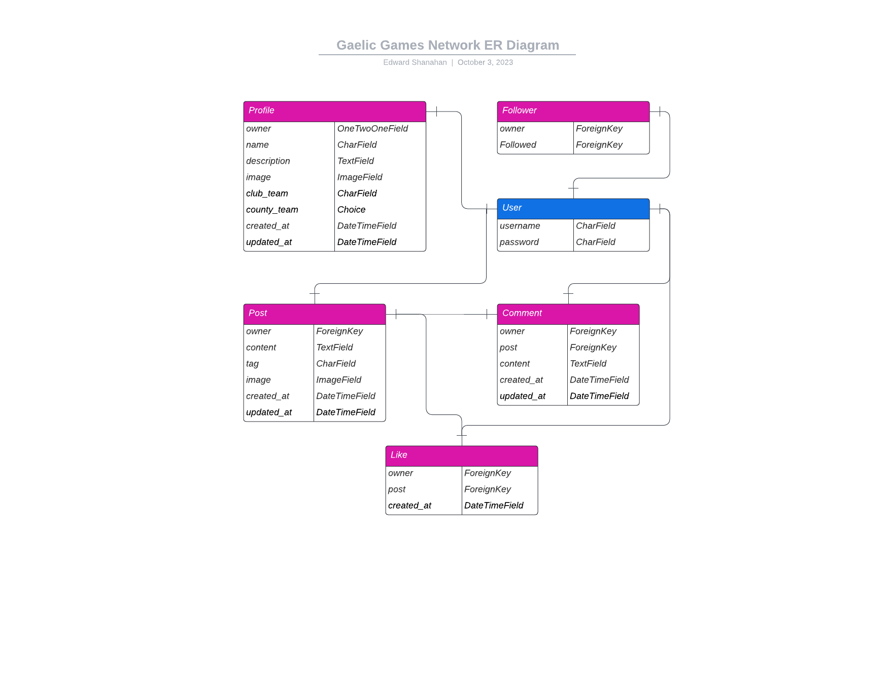

# Gaelic Games Network
The Gaelic Games Network (GGN) is a dynamic and interactive social media platform designed specifically for enthusiasts and followers of Gaelic Athletic Association (GAA) events, teams, and topics. This application provides a space for GAA fans to connect, discuss, and engage with the vibrant GAA community.

## Contents
- [User Experience (UX)](#user-experience)
    - [Project Objective](#project-objective)
    - [User Stories](#user-stories)
        - [Sprint 1](#sprint-1)
        - [Sprint 2](#sprint-2)
        - [Sprint 3](#sprint-3)
        - [Sprint 4](#sprint-4)
        - [Sprint 5](#sprint-5)
- [Database Design](#database-design)
- [Languages and Frameworks](#languages-and-frameworks)
    - [Languages](#languages)
    - [Frameworks](#frameworks)
    - [Libraries Used](#libraries-used)

## User Experience

### Project Objective
Design and develop a social media application, Gaelic Games Network (GGN), that enables users to create and share posts related to Gaelic Athletic Association (GAA) events, teams, and topics. The app should allow users to tag posts with relevant hashtags, like, comment, and follow other users. The backend will be implemented using Django REST API, while the front end will be built using React, ensuring a seamless and engaging user experience. The objective is to provide a platform for GAA enthusiasts to connect, discuss, and engage with the GAA community.

### User Stories

#### Sprint 1
1. As a **User**, I can **view a navbar on every page** so that **I can navigate between pages**
2. As a **User**, I can **navigate through pages quickly**  so that **I can view content without pages refreshing**
3. As a **User**, I can **create an account**  so that **I can gain full features of the website**
4. As a **User**, I can **sign in**  so that **I can regain site full features**
5. As a **User**, I can **tell if I’m logged in** so that **gain full functionality of the website**
6. As a **User**, I can **see sign-in and sign-out pages**  so that **I can sign in/sign up**
7. As a **User**, I can **view avatars** so that **I can identify other other users**
8. As a **User**, I can **have my logged-in status until I choose to log out** so that **my experience isn't compromised**

### Sprint 2
1. As a **Logged In User**, I can **create a post**  so that **I can share my latest updated**
2. As a **User**, I can **view a post**  so that **I can learn more about that post**
3. As a **Logged In User**, I can **like a post ** so that **I can show my support to other users**

### Sprint 3
1. As a **User**, I can **view the most recent posts in order by the most recently created**  so that **keep up to date with new content**
2. As a **User**, I can **search for posts that have tags** so that **I can find posts related to my search**
3. As a **Logged In User**, I can see a list of posts from users that I follow so that I can keep up to date with their posts Acceptance criteria
4. As a **User**, I can **keep scrolling through posts automatically** so that **I don’t have to click next page**

### Sprint 4
1. As a **User**, I can **view a pos** so that **I can view a list of comments on posts**
2. As a **Post Owner**, I can **edit my post** so that **I can make any corrections or update the post**
3. As a **Logged In User**, I can **post a comment on a post** so that **I can share my opinion on the post**
4. As a **User**, I can **see the date on a comment ** so that **I know how old the comment is**
5. As a **User**, I can **comment on a post** so that **I can see what other users thought about the post**
6. As a **Comment Owner**, I can **delete my own comment on a post** so that **I can control my own comments**
7. As a **comment Owner**, I can **edit a comment on a post** so that **I can correct or update the comment**

### Sprint 5
1. As a **User**, I can **view other users** so that **I can see their posts and learn more about them**
2. As a **User**, I can **see a list of the most followed user profiles** so that **I can see which profiles are popular**
3. As a **Logged In User**, I can **see a list of all the users** so that **I can see who I can follow**
4. As a **User**, I can **see stats on a specific user profile page** so that **I can learn more about the user**
5. As a **Logged In User**, I can **follow and unfollow other users** so that **I can see or remove posts by specific users**
6. As a **Logged In User**, I can **edit my profile** so that **I can keep my profile update**
7. As a **User**, I can **update my username and password** so that **I can change my displayed name and keep my account secure**

## Database Design

## Languages and Frameworks

### Languages
- Python3
- JavaScript
- HTML and CSS

### Frameworks
- Django
- React
- Bootstrap

### Libraries Used
- Django 4.0
- django-cloudinary-storage 0.3.0
- Pillow 8.2.0
